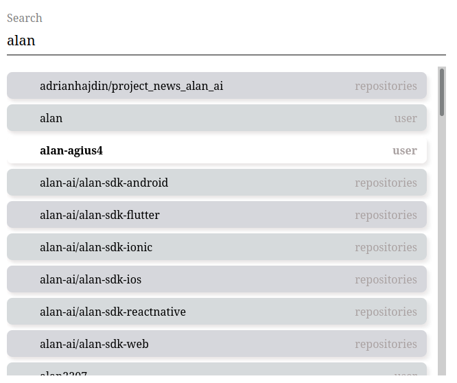

# GitHub repositories and users autocomplete component

Reusable and self-contained autocomplete
component, which can fetch matching users and repositories for
a given string of characters. It searches for users&repositories names in gitlab catalogue.

Requirements:
- Don’t use an existing autocomplete library (even if in real life this would be preferred).
- Minimal chars number to initialize search: 3.
- Result items are combined and displayed alphabetically using repository and profile name as ordering keys.
- Number of result items should be limited to 50 per request.
- The component should give visual feedback for when the data is being fetched, the results are empty, or the request resulted in an error.
- The component supports keyboard strokes (up and down arrows to browse the results, enter to open a new tab with the repository/user page).
- The solution should also display a meaningful snippet of your ability to test the code.

## To run project

### `npm start`

## To fire tests

### `npm test`

